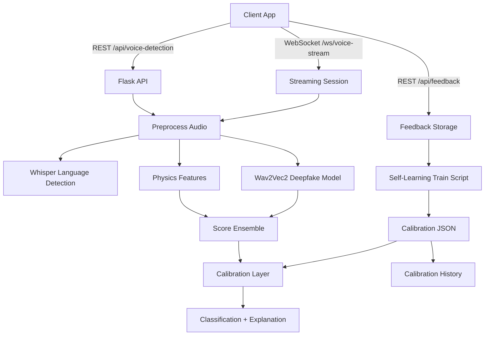

# 🎙️ Voice Detection API

A production-ready REST API that detects whether a voice recording is AI-generated or human using hybrid analysis (physics-based + deep learning).

## 🌟 Features

- ✅ **Multi-language Support**: Tamil, English, Hindi, Malayalam, Telugu
- ✅ **Hybrid Detection**: Combines physics analysis + Wav2Vec2 deepfake detection
- ✅ **Language Detection**: Automatic language identification using Whisper
- ✅ **Secure**: API key authentication
- ✅ **Fast**: Auto-truncates to 30 seconds for quick processing
- ✅ **Production Ready**: Docker support, logging, health checks
- ✅ **Realtime Streaming**: WebSocket streaming with partial results
- ✅ **Self-Learning Ready**: Feedback collection + calibration training

## 📁 Project Structure

```
voice-detection-api/
├── app.py                 # Flask API application
├── detector.py            # Your HybridEnsembleDetector class
├── self_learning_train.py # Calibration training from feedback data
├── client.py              # Example Python client
├── test_api.py            # Automated test suite
├── requirements.txt       # Python dependencies
├── Dockerfile             # Docker configuration
├── docker-compose.yml     # Docker Compose setup
├── .env                   # Environment variables
├── DEPLOYMENT.md          # Detailed deployment guide
└── README.md             # This file
```

## 🚀 Quick Start

### Prerequisites

- Python 3.10+
- pip
- (Optional) Docker & Docker Compose

### Installation

1. **Clone the repository**
```bash
git clone <your-repo-url>
cd voice-detection-api
```

2. **Install dependencies**
```bash
pip install -r requirements.txt
```

3. **Set up environment variables**
```bash
# Copy the example .env file
cp .env.example .env

# Edit .env and set your API key
nano .env
```

4. **Run the API**
```bash
python app.py
```

The API will start at `http://localhost:5000`

## 🐳 Docker Deployment (Recommended)

### Quick Start with Docker Compose

```bash
# Start the API
docker-compose up -d

# Check status
docker-compose ps

# View logs
docker-compose logs -f

# Stop the API
docker-compose down
```

### Manual Docker Build

```bash
# Build image
docker build -t voice-detection-api .

# Run container
docker run -p 5000:5000 \
  -e API_KEY="your_secret_key" \
  voice-detection-api
```

## 📡 API Usage

### Health Check

```bash
curl http://localhost:5000/health
```

### Voice Detection

**Using cURL:**
```bash
curl -X POST http://localhost:5000/api/voice-detection \
  -H "Content-Type: application/json" \
  -H "x-api-key: sk_test_123456789" \
  -d '{
    "language": "English",
    "audioFormat": "mp3",
    "audioBase64": "'"$(base64 -w 0 your_audio.mp3)"'"
  }'
```

**Using Python Client:**
```bash
# Single file
python client.py --audio test_audio.mp3 --language English

# Multiple files
python client.py \
  --audio file1.mp3 \
  --audio file2.mp3 \
  --language Tamil
```

**Using Python Requests:**
```python
import requests
import base64

# Encode audio
with open('audio.mp3', 'rb') as f:
    audio_base64 = base64.b64encode(f.read()).decode()

# Make request
response = requests.post(
    'http://localhost:5000/api/voice-detection',
    headers={
        'Content-Type': 'application/json',
        'x-api-key': 'sk_test_123456789'
    },
    json={
        'language': 'English',
        'audioFormat': 'mp3',
        'audioBase64': audio_base64
    }
)

result = response.json()
print(f"Classification: {result['classification']}")
print(f"Confidence: {result['confidenceScore']}")
```

**Example response:**
```json
{
  "status": "success",
  "language": "English",
  "classification": "AI_GENERATED",
  "confidenceScore": 0.87,
  "explanation": "Deep learning model detected synthetic voice patterns (confidence: 87.0%)"
}
```

### Realtime Streaming (WebSocket)

Endpoint: `ws://localhost:5000/ws/voice-stream`

Authentication:
- Query param: `?api_key=sk_test_123456789`
- Or header: `x-api-key` (non-browser clients)

Recommended streaming format: `pcm16` (16kHz, mono). This allows partial
results while the audio is still streaming.
If you stream `mp3` or `wav`, partial results are disabled and analysis runs
on the final buffer.

**Client -> Server messages:**
```json
{ "type": "start", "audioFormat": "pcm16", "sampleRate": 16000, "channels": 1,
  "enablePartial": true, "partialIntervalSec": 10 }
```
```json
{ "type": "audio_chunk", "audioChunkBase64": "<base64_pcm_chunk>" }
```
```json
{ "type": "audio_chunk", "audioChunkBase64": "<base64_pcm_chunk>", "final": true }
```

**Server -> Client messages:**
```json
{ "type": "ack", "sessionId": "...", "status": "ready" }
```
```json
{ "type": "progress", "receivedBytes": 12345, "bufferBytes": 12345, "bufferSeconds": 2.1 }
```
```json
{ "type": "partial_result", "result": { "status": "success", "classification": "AI_GENERATED" } }
```
```json
{ "type": "final_result", "result": { "status": "success", "classification": "HUMAN" } }
```

**Example final_result payload:**
```json
{
  "type": "final_result",
  "result": {
    "status": "success",
    "classification": "AI_GENERATED",
    "confidenceScore": 0.81,
    "explanation": "Acoustic parameters lack natural human variability",
    "detectedLanguage": "English",
    "analysisMode": "full"
  }
}
```

**Browser example:**
```javascript
const ws = new WebSocket("ws://localhost:5000/ws/voice-stream?api_key=sk_test_123456789");
ws.onopen = () => {
  ws.send(JSON.stringify({
    type: "start",
    audioFormat: "pcm16",
    sampleRate: 16000,
    channels: 1,
    enablePartial: true
  }));
  // Send base64-encoded PCM16 chunks as they arrive
  ws.send(JSON.stringify({ type: "audio_chunk", audioChunkBase64: chunkBase64 }));
  ws.send(JSON.stringify({ type: "audio_chunk", audioChunkBase64: lastChunkBase64, final: true }));
};
ws.onmessage = (event) => console.log(event.data);
```

### Feedback (Self-Learning)

Send labeled audio samples so the model can periodically recalibrate.

```bash
curl -X POST http://localhost:5000/api/feedback \
  -H "Content-Type: application/json" \
  -H "x-api-key: sk_test_123456789" \
  -d '{
    "label": "AI_GENERATED",
    "audioFormat": "mp3",
    "audioBase64": "'"$(base64 -w 0 new_ai_sample.mp3)"'"
  }'
```

Stored samples are written to `data/feedback/<LABEL>/YYYYMMDD/` along with
metadata JSON files and an index.

**Example response:**
```json
{
  "status": "success",
  "id": "3b4f99a1-7c2e-4a0f-ae02-3a3f8b1f1f90",
  "label": "AI_GENERATED",
  "audioFormat": "mp3",
  "stored": true
}
```

### Train Calibration (Self-Learning)

This trains a lightweight calibration layer using feedback samples:
```bash
python self_learning_train.py --data-dir data/feedback --output data/calibration.json
```

If `CALIBRATION_PATH` exists, the API loads it on startup.

When retraining, the script will automatically archive the previous calibration
to `CALIBRATION_HISTORY_DIR` before writing the new file.

Reload calibration without restarting the API:
```bash
curl -X POST http://localhost:5000/api/reload-calibration \
  -H "x-api-key: sk_test_123456789"
```

Backup the current calibration (creates a timestamped copy):
```bash
curl -X POST http://localhost:5000/api/backup-calibration \
  -H "x-api-key: sk_test_123456789" \
  -d '{"reason": "pre_retrain"}'
```

List calibration history:
```bash
curl -X GET http://localhost:5000/api/calibration-history \
  -H "x-api-key: sk_test_123456789"
```

Rollback to a previous calibration:
```bash
curl -X POST http://localhost:5000/api/rollback-calibration \
  -H "x-api-key: sk_test_123456789" \
  -d '{"versionId": "20260207T120000Z_ab12cd34"}'
```

## 📊 Response Format

### Success Response
```json
{
  "status": "success",
  "language": "English",
  "classification": "AI_GENERATED",
  "confidenceScore": 0.91,
  "explanation": "Deep learning model detected synthetic voice patterns (confidence: 92.5%)"
}
```

### Error Response
```json
{
  "status": "error",
  "message": "Invalid API key"
}
```

## 🔑 Authentication

All requests to `/api/voice-detection` require an API key in the header:

```
x-api-key: your_api_key_here
```

**Setting API Key:**
```bash
# In .env file
API_KEY=sk_test_123456789

# Or as environment variable
export API_KEY="your_secure_key"
```

## 🧪 Testing

### Run Test Suite
```bash
pytest
```

### Integration Tests (full model)
```bash
RUN_MODEL_TESTS=true pytest -m integration
```
Set `AI_MISS_AUDIO_PATH` to point at a known false-negative AI sample to
track improvements after recalibration.

### Manual Testing
```bash
# Health check
curl http://localhost:5000/health

# Test with sample audio
python client.py --audio test_audio.mp3
```

## 📝 Supported Features

### Languages
- Tamil
- English
- Hindi
- Malayalam
- Telugu

### Classifications
- `AI_GENERATED` - Synthetic/AI voice
- `HUMAN` - Real human voice

### Audio Requirements
- Format: MP3 only
- Input: Base64 encoded
- Max duration: 30 seconds (auto-truncated)

## ⚙️ Configuration

### Environment Variables

| Variable | Default | Description |
|----------|---------|-------------|
| `API_KEY` | `sk_test_123456789` | API authentication key |
| `PORT` | `5000` | Server port |
| `FLASK_ENV` | `production` | Flask environment |
| `ENABLE_STREAMING` | `true` | Enable WebSocket streaming endpoint |
| `STREAMING_MAX_BUFFER_SECONDS` | `30` | Max audio seconds buffered for streaming |
| `STREAMING_PARTIAL_INTERVAL_SECONDS` | `10` | Partial result interval for streaming |
| `STREAMING_PARTIAL_MODE` | `physics` | Partial mode: `full`, `physics`, or `dl` |
| `STREAMING_MAX_CHUNK_BYTES` | `2097152` | Max size per streaming chunk |
| `ENABLE_FEEDBACK_STORAGE` | `true` | Enable feedback storage for self-learning |
| `FEEDBACK_STORAGE_DIR` | `data/feedback` | Feedback storage directory |
| `FEEDBACK_MAX_BYTES` | `15728640` | Max feedback payload size |
| `CALIBRATION_PATH` | `data/calibration.json` | Calibration file path |
| `SKIP_MODEL_LOAD` | `false` | Skip loading models at startup (useful for tests) |
| `CALIBRATION_HISTORY_DIR` | `data/calibration_history` | Calibration backup directory |
| `CALIBRATION_HISTORY_MAX` | `50` | Max calibration backups retained |

### Model Configuration

Edit the detector initialization in `app.py`:

```python
detector = HybridEnsembleDetector(
    physics_weight=0.4,        # Physics model weight
    dl_weight=0.6,             # Deep learning weight
    max_audio_duration=30      # Max seconds to process
)
```

## 🏗️ Architecture

### System Overview (Mermaid)



### Detection Pipeline

1. **Audio Input** → Base64 MP3
2. **Preprocessing** → Decode, convert to 16kHz mono
3. **Language Detection** → Whisper model identifies language
4. **Physics Analysis** → Acoustic feature extraction
5. **Deep Learning** → Wav2Vec2 deepfake detection
6. **Ensemble** → Weighted combination of scores
7. **Classification** → AI_GENERATED or HUMAN

### Models Used

- **Deepfake Detector**: `garystafford/wav2vec2-deepfake-voice-detector`
- **Language Detector**: `openai/whisper-base`

## 📈 Performance

- **Processing Time**: 2-10 seconds per audio
- **Memory**: ~2GB RAM minimum
- **Accuracy**: Varies by language and audio quality
- **Throughput**: ~5-10 requests/minute per worker

## 🔧 Troubleshooting

### Models Not Loading
```bash
# Pre-download models
python -c "from transformers import AutoModelForAudioClassification; \
  AutoModelForAudioClassification.from_pretrained('garystafford/wav2vec2-deepfake-voice-detector')"
```

### Port Already in Use
```bash
# Change port in .env
PORT=8000

# Or use environment variable
PORT=8000 python app.py
```

### Memory Issues
- Reduce `max_audio_duration` to 15 seconds
- Use fewer Docker workers
- Increase system RAM

## 📖 Documentation

- **Full Deployment Guide**: See [DEPLOYMENT.md](DEPLOYMENT.md)
- **API Reference**: See API section above
- **Model Details**: See `detector.py` comments

## 🛡️ Security Notes

- Never commit API keys to version control
- Use strong, random API keys in production
- Enable HTTPS/TLS for production deployments
- Implement rate limiting for production use
- Regularly update dependencies

## 🚀 Production Deployment

### Using Gunicorn
```bash
gunicorn --bind 0.0.0.0:5000 --workers 2 --timeout 120 app:app
```

### With Nginx Reverse Proxy
See [DEPLOYMENT.md](DEPLOYMENT.md) for Nginx configuration

### Cloud Platforms
- AWS: EC2 + Docker or Elastic Beanstalk
- Google Cloud: Cloud Run or Compute Engine
- Azure: App Service or Container Instances
- Heroku: Supports Python + Docker

## 📞 Support

For issues or questions:
1. Check [DEPLOYMENT.md](DEPLOYMENT.md)
2. Run test suite: `python test_api.py`
3. Check logs: `docker-compose logs`

## 📄 License

This project uses open-source models:
- Wav2Vec2: Apache 2.0
- Whisper: MIT

## 🙏 Credits

- **Models**: HuggingFace transformers
- **Framework**: Flask
- **Audio Processing**: Librosa, SoundFile

---

**Version**: 1.0.0  
**Status**: Production Ready ✅  
**Last Updated**: February 2026