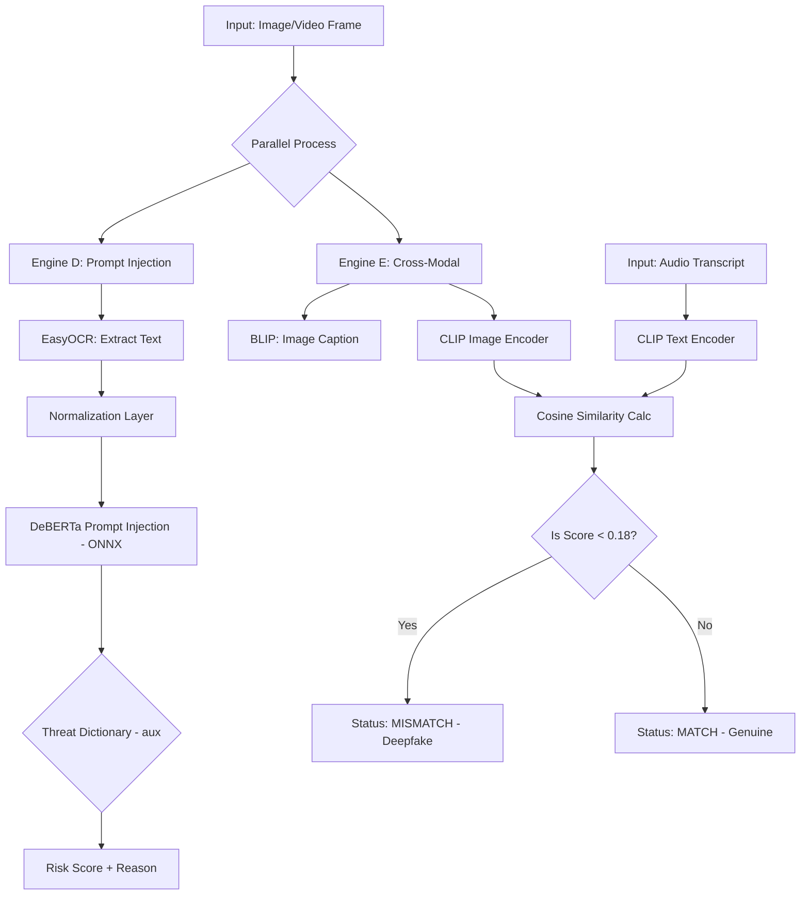

# Multimodal Visual Security Engine (EasyOCR + ONNX DeBERTa + CLIP + BLIP)

## System Architecture



**Engine D (Visual Prompt Injection)**  
OCR-based text extraction + ML classification. EasyOCR extracts visible or hidden text (with CLAHE + Otsu binarization for low-contrast regions), a normalization layer de-obfuscates tokens, and a DeBERTa prompt‑injection classifier (ONNX runtime) scores risk. A small threat dictionary is used as auxiliary evidence in the reason string, not as the primary detector.

**Engine E (Cross-Modal Consistency)**  
Semantic-based (not OCR). CLIP (ViT-B/32) embeds both the video frame and the audio transcript into a shared vector space to verify that the visual context matches the spoken context. BLIP generates an image caption and we compare it with OCR text to detect prompt/scene misalignment.

**Deepfake Detection (Video)**  
Per-frame vision deepfake detection uses a pretrained image classifier (`SENTINEL_DEEPFAKE_MODEL`, default: `dima806/deepfake_vs_real_image_detection`). Audio-visual sync estimates lip-motion vs audio energy correlation to flag mismatches.

## Quick Start

```bash
# Install dependencies
pip install -r requirements.txt

# Run the Image APIs
uvicorn src.api.engine_d_server:app --host 0.0.0.0 --port 8001
uvicorn src.api.engine_e_server:app --host 0.0.0.0 --port 8002
uvicorn src.api.gateway_server:app --host 0.0.0.0 --port 8000

# Run the Video API
uvicorn src.api.video_server:app --host 0.0.0.0 --port 8010

# Run the Streamlit UI
streamlit run app.py
```
